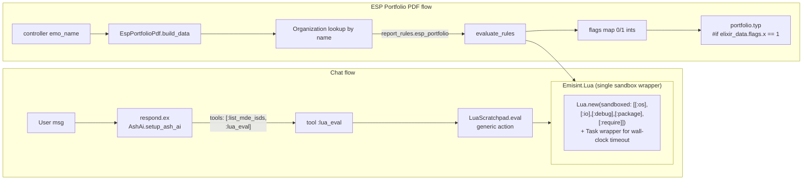

# Lua POC: Chat Calculator Tool + Per-EMO PDF Widget Rules

## Context

We want to evaluate whether the [`lua` hex package](https://hexdocs.pm/lua/) (tv-labs/lua, ergonomic Luerl wrapper, latest v0.4.0) can unlock interesting product capabilities in Emisint. The original pitch — user-defined Schedule 7-1 goal formulas — has no landing spot anymore: `Compliance`, `Registry`, and `Analytics` Ash domains were deleted in the `resource_cleanup` PR, and the codebase has pivoted to concrete MDE resources under `lib/emisint/assessments/`. Stale references live in `test/emisint/compliance/` and `test/emisint/workers/goal_recalculation_worker_test.exs` (flagged here, not touched).

Two POC slots that DO fit the current codebase:

1. **Chat calculator tool** — expose Lua as an AshAi tool so the LLM agent (already wired in `lib/emisint/chat/message/changes/respond.ex`) can compute derived numbers (weighted averages, ad-hoc deltas) without us hand-rolling an Elixir tool per math request.
2. **Per-EMO PDF widget rules** — let each `Organization` carry small Lua snippets that gate optional callouts in `esp_portfolio.pdf`. The Typst template already uses `#if … .len() > 0` patterns and has a `to-bool` helper, so the missing piece is *who decides what's true*.

Goal: one chat tool, one PDF widget rule, end-to-end, so the team can feel the shape before committing to a full feature.

## Shape



Both consumers funnel through one `Emisint.Lua.eval/3` so the sandbox + timeout + error contract is defined once.

## Files to create / modify (in execution order)

### 1. Dependency
- `mix.exs`: add `{:lua, "~> 0.4"}` to `deps/0` (verify exact latest before commit).
- Run `mix deps.get`; if NIF arch mismatch on this host (Rosetta/arm64), follow the `arm64-deps-rebuild` skill. Lua/Luerl is pure BEAM so it should *not* need rebuilding — note this in the PR if it does.

### 2. Sandbox wrapper — new file `lib/emisint/lua.ex`
- Public API: `eval(code, bindings \\ %{}, opts \\ [])` → `{:ok, value} | {:error, term()}`.
- Build state with `Lua.new(sandboxed: [[:os], [:io], [:debug], [:package], [:require], [:load], [:loadfile], [:dofile]])`.
- Inject bindings via `Enum.reduce(bindings, lua, fn {k, v}, l -> Lua.set!(l, [to_string(k)], v) end)`.
- Wrap `Lua.eval!/2` in `try/rescue` to convert raises to `{:error, reason}`.
- Wall-clock timeout: `Task.async(fn -> … end)` then `Task.yield(task, ms) || Task.shutdown(task, :brutal_kill)`. Default `opts[:timeout]` = `100`. Return `{:error, :timeout}` on shutdown. Luerl is synchronous and pure-BEAM, so `Task.shutdown` reliably ends an infinite loop.
- Result normalization: `Lua.eval!` returns `{[results], _state}`; the wrapper unwraps to `hd(results)` (or `nil` if empty), so callers get a plain value.

### 3. Tests — new file `test/emisint/lua_test.exs`
- happy path: `eval("return 1 + 1")` → `{:ok, 2}` (Luerl returns integers as integers / floats per Lua semantics; assert with pattern match accepting either).
- bindings: `eval("return x * 2", %{"x" => 21})` → `{:ok, 42}`.
- syntax error: `eval("return nope nope")` → `{:error, _}` (no raise).
- runtime error: `eval("local t = nil; return t.x")` → `{:error, _}`.
- sandbox: `eval("return os.time()")` → `{:error, _}` (os table absent under sandbox).
- timeout: `eval("while true do end", %{}, timeout: 50)` → `{:error, :timeout}`.

### 4. AshAi tool wiring

**New file** `lib/emisint/assessments/lua_scratchpad.ex` — a no-data-layer resource that carries the generic action backing the tool:
```elixir
defmodule Emisint.Assessments.LuaScratchpad do
  use Ash.Resource, otp_app: :emisint, domain: Emisint.Assessments

  actions do
    action :eval, :string do
      description "Evaluate a snippet of sandboxed Lua and return the result as a string."
      argument :code, :string, allow_nil?: false,
        description: "Lua source. Must `return` a value. Stdlib paths os/io/debug/package/require are unavailable."

      run fn input, _ctx ->
        case Emisint.Lua.eval(input.arguments.code) do
          {:ok, v} -> {:ok, inspect(v)}
          {:error, reason} -> {:error, Ash.Error.Unknown.exception(error: "Lua error: #{inspect(reason)}")}
        end
      end
    end
  end
end
```
No `postgres`, no `attributes`, no `policies` (action is invoked via the tool runner; AshAi handles auth). If Ash complains about missing primary key on a resource without a data layer, swap to `data_layer: Ash.DataLayer.Simple`.

**Edit** `lib/emisint/assessments.ex:8-15` — extend the existing `tools do` block:
```elixir
tool :lua_eval, Emisint.Assessments.LuaScratchpad, :eval do
  description """
  Evaluate a sandboxed Lua snippet. Use for ad-hoc math the user asks you to do.
  Pass the Lua source as `code`. The snippet MUST `return` a value.
  Example: code = "return (240 * 0.175)" → "42.0"
  """
end
```
Also register the resource in the `resources do` block (with no `define`s).

**Edit** `lib/emisint/chat/message/changes/respond.ex:43-45` — extend the tools list:
```elixir
tools: [:list_mde_isds, :lua_eval],
```

### 5. Per-EMO PDF widget rule

**Edit** `lib/emisint/accounts/organization.ex`:
- Add attribute (in `attributes do`):
  ```elixir
  attribute :report_rules, :map do
    public? true
    default %{}
  end
  ```
- Add `:report_rules` to the `update` action's `accept` list.

Run `mix ash.codegen add_report_rules_to_organizations` then `mix ash.migrate`. Review the generated migration before applying.

**Edit** `lib/emisint/reports/portfolio/esp_portfolio_pdf.ex` — in `build_data/2` (line 31):
- Before returning the data map, look up the organization: `org = Ash.read_first!(Organization |> Ash.Query.filter(name == ^emo_name), authorize?: false)` (returns `nil` if absent).
- Compute flags map:
  ```elixir
  flags =
    case org && get_in(org.report_rules, ["esp_portfolio"]) do
      rules when is_map(rules) ->
        bindings = rule_bindings(mstep_raw, sat_raw, length(schools))
        Map.new(rules, fn {flag_name, code} ->
          val =
            case Emisint.Lua.eval(code, bindings) do
              {:ok, true} -> 1
              {:ok, n} when is_number(n) and n != 0 -> 1
              _ -> 0
            end
          {flag_name, val}
        end)
      _ -> %{}
    end
  ```
- A new private `rule_bindings/3` exposes a small, intentional surface (NOT the whole data map — keeps the rule contract stable):
  ```elixir
  defp rule_bindings(mstep, sat, school_count) do
    %{
      "school_count" => school_count,
      "mstep_below_count" => Enum.count(mstep, fn s -> (s.delta || 0) <= 0 end),
      "mstep_exceeds_count" => Enum.count(mstep, fn s -> (s.delta || 0) > 0 end),
      "sat_below_count" => Enum.count(sat, fn s -> (s.delta || 0) <= 0 end),
      "sat_exceeds_count" => Enum.count(sat, fn s -> (s.delta || 0) > 0 end)
    }
  end
  ```
- Add `flags: flags` to the returned map.

**Edit** `priv/typst/portfolio/portfolio.typ`:
- Add a binding near line 165 (after `#let sat-data = elixir_data.sat`): `#let flags = elixir_data.at("flags", default: (:))`.
- Add ONE gated callout block right after the M-STEP summary cards (around line 205, after `#v(8pt)`):
  ```typst
  #if to-num(flags.at("growth_at_risk", default: 0)) == 1 {
    rect(width: 100%, inset: (x: 10pt, y: 8pt),
         fill: rgb("#fef2f2"), stroke: 0.5pt + rgb("#dc2626"))[
      #text(size: 8pt, weight: "semibold", fill: rgb("#991b1b"),
        "Growth at risk — over half of schools are below their LEA on M-STEP.")
    ]
    v(6pt)
  }
  ```
  Integer 0/1 dodges the documented Typst string-bool coercion bug; `to-num` is already defined in this template.

### 6. Seed update — `priv/repo/seeds.exs`
- In the `Organization.create!` call (line 21), add:
  ```elixir
  report_rules: %{
    "esp_portfolio" => %{
      "growth_at_risk" => "return mstep_below_count > mstep_exceeds_count"
    }
  }
  ```
  This requires temporarily widening the `:create` action's `accept` to include `:report_rules`, OR using `Ash.Changeset.force_change_attribute/3` in the seed. Prefer the latter — keeps the create action's public surface narrow.

## Verification

End-to-end checks (run after implementation):

- `mix test test/emisint/lua_test.exs` — sandbox + eval contract green.
- `mix test` — full suite still passes (no existing test files modified).
- `iex -S mix phx.server` → sign in as `admin@cornerstone-emo.edu` → open the chat LiveView → prompt: `"Using lua, compute (240 * 0.175) and tell me the result."` Expect a `:lua_eval` tool call visible in the thread and a reply mentioning `42`.
- Navigate to `/esp-portfolio`, render PDF for the seeded EMO. With M-STEP data where below > exceeds, the red "Growth at risk" callout renders. Flip the rule body to `return false` (re-seed) → re-render → callout absent.

## Out of scope (explicit non-goals)

- Admin UI for authoring `report_rules` (Phase 2).
- Per-school rule scope, multi-rule validation, error surfacing in the LiveView.
- Cleanup of stale `test/emisint/compliance/**` and `test/emisint/workers/goal_recalculation_worker_test.exs` — orphans from the deleted domains, separate PR.
- Lua-as-Schedule-7-1-goal-DSL — the original pitch; no landing spot in the current schema.

## Risks / open questions

- **AshAi generic action support**: confirmed `tool :name, Resource, :action_type` accepts any action including generic; if the runner balks at a no-data-layer resource, fall back to `data_layer: Ash.DataLayer.Simple`.
- **Bindings type coercion**: Luerl maps Elixir ints/floats/strings/bools transparently; nested maps work but require keys-as-strings. The rule_bindings/3 surface deliberately uses flat string-keyed values to avoid surprises.
- **Timeout semantics**: `Task.shutdown(:brutal_kill)` ends the wrapper process; the Luerl VM lives entirely inside that process, so the kill is sufficient. No leaked schedulers.
- **Sandbox completeness**: `lua` 0.4.0's `:sandboxed` paths block stdlib subtrees. We strip `os`, `io`, `debug`, `package`, `require`, `load`, `loadfile`, `dofile`. Math + string + table remain — sufficient for the chat calculator and rule expressions.
